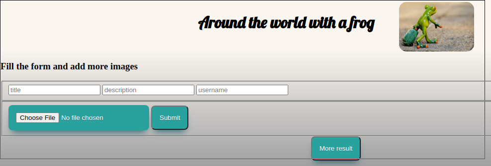

# Imageboard

After cloning the project to your favority location, install with:

```sh
$ npm install 

```
The tables squemas can be found in `./sql/images.sql`. With it, you can configure your own 
postgresql tables. 

To upload images, it is needed a configuration with AWS. Add to the root dir a file `secrete.json` with the
following content. 


```json
{
    "awsKey": "YOURKEY",
    "awsSecret": "YOURSECRET"
}

```
Finally run the project with: 


```sh
$ node . 

```
### Example page


